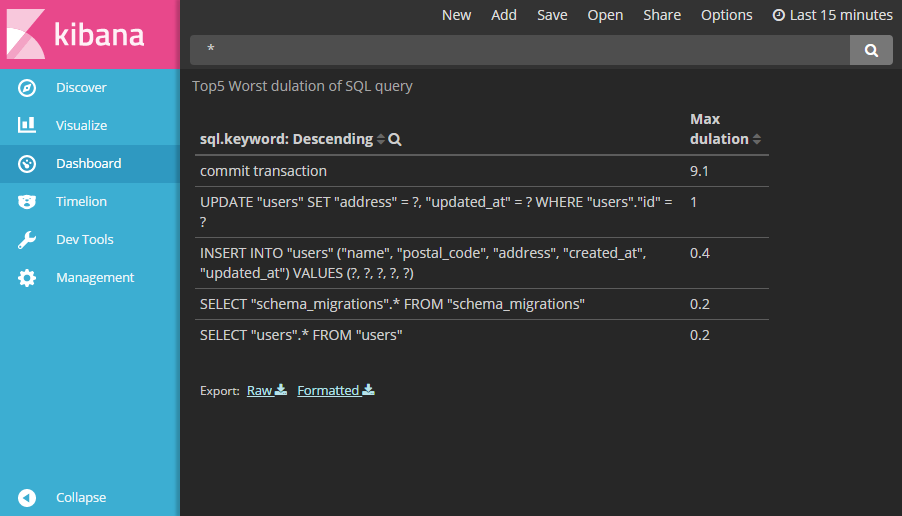

[](MIT-LICENSE)
[](https://badge.fury.io/rb/sqlogger)
[](https://travis-ci.org/metalels/sqlogger)
[](https://codeclimate.com/github/metalels/sqlogger)
[](https://codeclimate.com/github/metalels/sqlogger/coverage)
[](https://codeclimate.com/github/metalels/sqlogger)

# Sqlogger
Collect 'ActiveRecord sql query' to monitoring system(s) for development.



## Dependency
Currently supports Rails **3.1.0** and **upper**.  
Tested minor version between **3.1.0** and **5.1.0beta1**

## Installation
Add this line to your application's Gemfile:
**recommend to use development only**

```ruby
gem 'sqlogger', group: :development
```

And then execute in Rails Project root directory:
```bash
$ bundle
$ rake sqlogger:install
```

## Usage
edit sqlogger setting file in *config/initializers/sqlogger.rb*.

## Contributing
git-flow.

